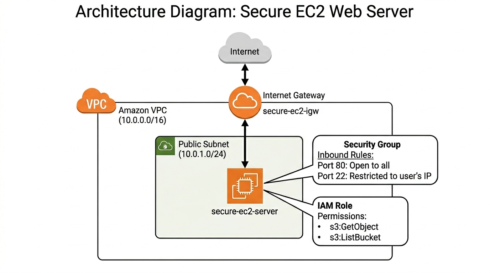
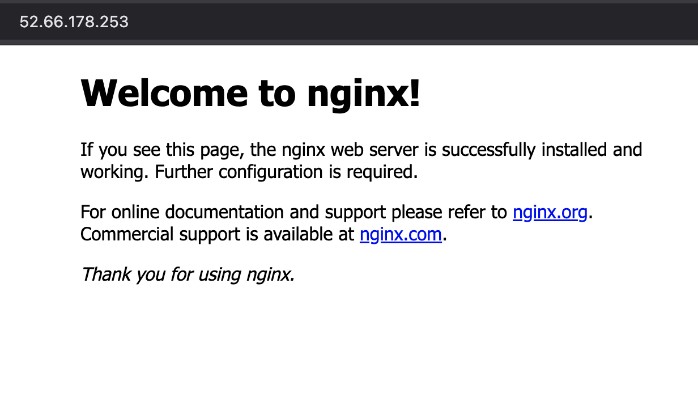
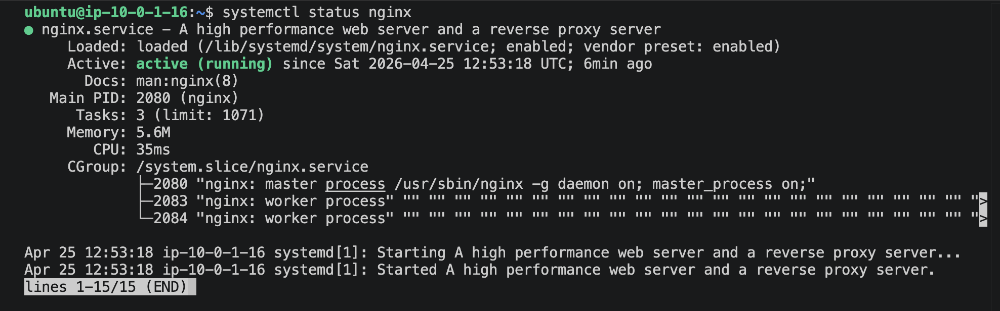
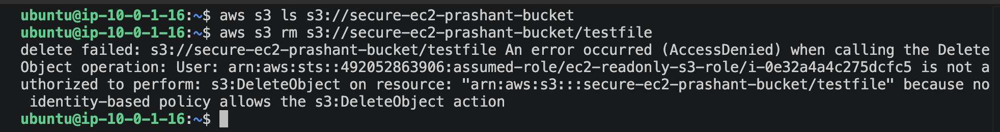

# SecureEC2

## What this project does
A foundational AWS networking and security project that deploys an Nginx web server on an EC2 instance within a custom VPC. It emphasizes cloud security best practices by implementing strict Security Group rules (restricting SSH to a single IP) and attaching a least-privilege IAM role for highly targeted S3 access.

## Architecture


## Tech Stack
* **Amazon VPC:** Custom network isolation (Subnets, Internet Gateway, Route Tables)
* **Amazon EC2:** Compute instance running Linux (Ubuntu)
* **AWS Security Groups:** Instance-level virtual firewall
* **AWS IAM:** Identity and Access Management (Least-privilege Roles, Policies, and Trust Relationships)
* **Amazon S3:** Object storage (accessed securely from EC2)
* **Nginx:** Web server

## How to reproduce

**1. Network Setup**
* Create a custom VPC (`10.0.0.0/16`).
* Create a Public Subnet (`10.0.1.0/24`) and enable auto-assign public IPv4 addresses.
* Create an Internet Gateway (`secure-ec2-igw`) and attach it to the VPC.
* Update the Public Subnet's Route Table to point `0.0.0.0/0` to the Internet Gateway.

**2. IAM Role Configuration (Least Privilege)**
* Create a custom **Trust Policy** (`trust-policy.json`) to allow EC2 to assume the role:
    ```json
    {
      "Version": "2012-10-17",
      "Statement": [
        {
          "Effect": "Allow",
          "Principal": {
            "Service": "ec2.amazonaws.com"
          },
          "Action": "sts:AssumeRole"
        }
      ]
    }
    ```
* Create a new **IAM Policy** (`iam-policy.json`) scoped exactly to the target S3 bucket:
    ```json
    {
        "Version": "2012-10-17",
        "Statement": [
            {
                "Sid": "ListBucket",
                "Effect": "Allow",
                "Action": "s3:ListBucket",
                "Resource": "arn:aws:s3:::secure-ec2-prashant-bucket"
            },
            {
                "Sid": "GetObject",
                "Effect": "Allow",
                "Action": "s3:GetObject",
                "Resource": "arn:aws:s3:::secure-ec2-prashant-bucket/*"
            }
        ]
    }
    ```
* Create the IAM Role, apply the Trust Policy, and attach the IAM Policy.

**3. Security Group Setup**
* Create a Security Group in the custom VPC.
* **Inbound Rule 1:** HTTP (Port 80) -> Source: `0.0.0.0/0` (Anywhere IPv4).
* **Inbound Rule 2:** SSH (Port 22) -> Source: `YOUR_IP_ADDRESS/32` (My IP).

**4. EC2 Launch**
* Launch an Ubuntu EC2 instance in the Public Subnet.
* Attach the previously created Security Group.
* Attach the IAM role.
* Pass the following `user-data.sh` script to install and start Nginx automatically on boot:
    ```bash
    #!/bin/bash

    apt update -y
    apt install nginx -y 
    systemctl enable nginx
    systemctl start nginx

    echo "user-data script completed" >> /var/log/user-data.log
    ```

## Verification
* **Web Access:** Navigated to the EC2 Public IP in a web browser to verify the default Nginx page loads successfully.
* **Network Security:** Confirmed SSH access works from my whitelisted IP, but times out when attempted from a different network/IP.
* **IAM Least Privilege:** SSH'd into the instance and used the AWS CLI to test S3 access. Successfully ran `aws s3 ls s3://secure-ec2-prashant-bucket` (worked — proving read access),
and verified that `aws s3 rm` returned `AccessDenied` (proving delete is blocked).





## What I'd improve next
* **Implement an Application Load Balancer (ALB):** Move the EC2 instance into a Private Subnet for better security, and place an ALB in the Public Subnet to handle incoming internet traffic and forward it to the instance.
* **Infrastructure as Code (IaC):** Rebuild the entire manual setup using Terraform or AWS CloudFormation to make the deployment repeatable, version-controlled, and automated.
* * **HTTPS:** Add an SSL certificate via AWS Certificate Manager and configure Nginx to serve traffic on port 443.
